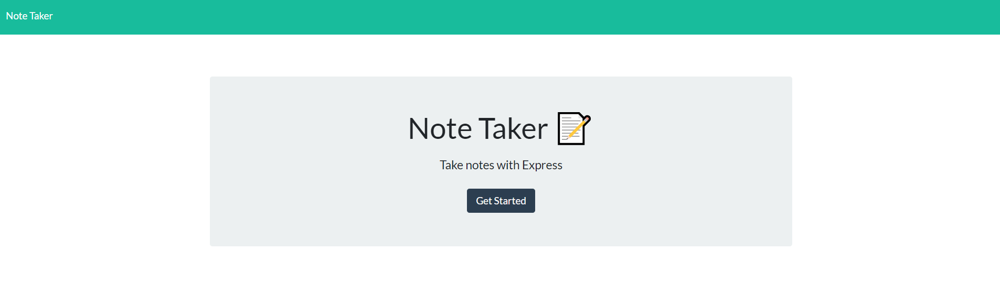
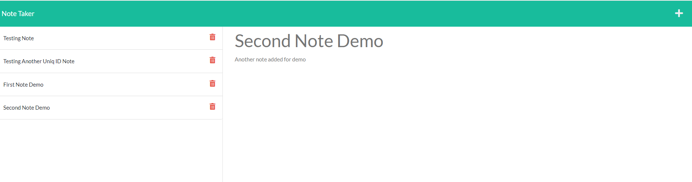

# Note Taker 

  

 ## Description

 This application will use an Express.js back end and will save and retrieve note data from a JSON file.

  ## Installation

  To install the neccesary dependencies (express and uuid), run the following command:

  npm i

  ## Usage

  1. Git clone the repo down to your local.  
  2. Run npm i to install the  express and uuid packages.
  4. Run npm start to initialize the application.
  4. Open http://localhost:3001 
  

  

  

 ## Links

 * Link to full video presentation: 

   https://drive.google.com/file/d/1kQa93iGXoHU0wSAu72I4T_sxas1F1Xcp/view

 * The URL of the deployed application (Heroku):

    https://powerful-forest-25176.herokuapp.com/ 

 * The URL of the GitHub repository:

    https://github.com/cdona0908/note-taker.git 

 ## Programming Languages

  * NodeJS
  * JavaScript

  ## License

  
  This project is licensed under MIT license. 

  ## Contributing
  
  If you like to contribute to this application, please refer to the following guidelines:

  Please refer to the Contributor Covenant v2.1 in the following  website: https://www.contributor-covenant.org for guidelines details on how to contribute

  ## Questions

  You can find me on Github: [cdona0908](https://github.com/cdona0908)  
  Any questions? Email me to : celiamdona@gmail.com